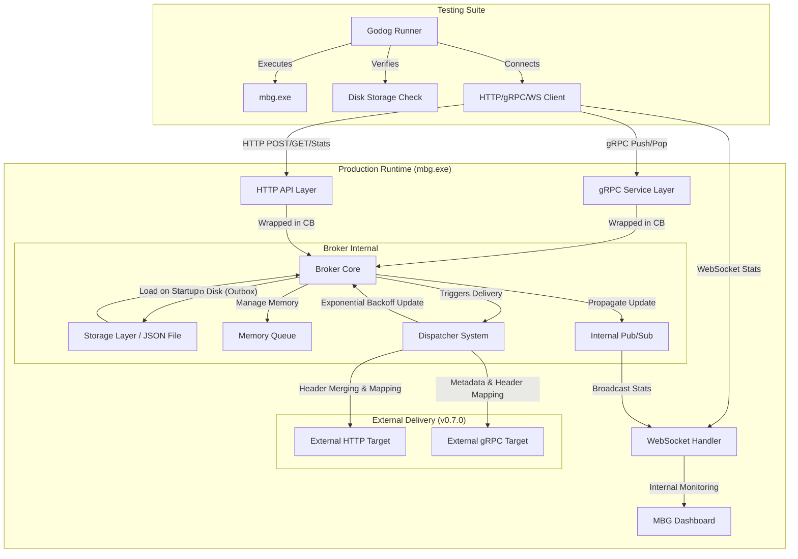
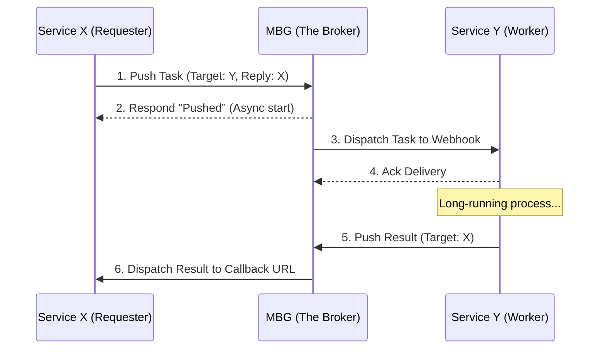

# Arsitektur Sistem Message Broker (MBS) - Lanjutan

Sistem MBS kini memiliki kemampuan observabilitas yang lebih baik dan strategi pengujian yang komprehensif.

## Diagram Arsitektur Komponen dan Pengujian

## Komponen Utama Baru (Lanjutan)

### 1. Strategi Pengujian E2E (End-to-End)
Sistem ini kini diverifikasi menggunakan strategi pengujian terhadap objek binari asli (`mbg.exe`). Ini menjamin bahwa perilaku sistem di lingkungan produksi benar-benar sesuai dengan spesifikasi fungsional:
- **Verifikasi Protokol**: Pengujian secara sinkron terhadap gRPC, HTTP, dan WebSocket.
- **Isolasi Skenario**: Setiap skenario pengujian secara dinamis memulai dan mematikan proses `mbg.exe` untuk menjamin kebersihan state antar pengujian.
- **Validasi Durabilitas**: Pengujian memverifikasi keberadaan file JSON di `../data/messages/` untuk memastikan persistensi benar-benar terjadi sebelum respons dikembalikan ke klien.

### 2. Dukungan JSON Dinamis (Go Generics)
Implementasi inti `Broker[T any]` kini menggunakan tipe data `any` yang memungkinkan sistem untuk menerima, menyimpan, dan meneruskan payload JSON apa pun secara transparan. Handler gRPC dan HTTP melayani sebagai gerbang (*gateways*) yang melakukan unmarshaling/marshaling secara otomatis ke dalam model data `models.Message[any]`, menjamin fleksibilitas tingkat tinggi tanpa mengorbankan integritas model pesan.

### 3. Kemampuan Observabilitas (Dashboard Only)
Dasbor waktu nyata (MBG Dashboard) bukan hanya sekadar visualisasi, tetapi juga berfungsi sebagai titik verifikasi kesehatan sistem (*health check*) yang memantau metrik antrean secara kontinu melalui WebSockets. Jalur WebSocket (`/ws`) saat ini bersifat *read-only* dan didedikasikan sepenuhnya untuk operasional Dashboard.

### 4. Automated Dispatch, Exponential Backoff & Header Support
Sistem pengiriman sekarang secara otomatis memonitor seluruh pesan antrean yang siap untuk diteruskan (*ready to be dispatched*) menggunakan `Dispatcher` yang berjalan secara asynchronous:
- Secara adaptif mengubah jarak waktu pengiriman ulang (*NextRetry*) berdasarkan kelipatan *Exponential Backoff* saat percobaan pertama gagal.
- **Header Propagation**: Pengiriman pesan kini mendukung pengiriman metadata tambahan (sepertitoken otorisasi) melalui HTTP Headers dan gRPC Metadata. Sistem secara otomatis menyertakan `X-Message-ID` untuk pelacakan.
- **Payload Refinement**: Khusus untuk target HTTP, sistem kini melakukan *decoupling* antara metadata broker dan data bisnis dengan hanya mengirim field `payload` di dalam request body.
- **Header Merging Strategy**: Sistem menggabungkan *default headers* dari konfigurasi target dengan *dynamic headers* dari payload pesan, di mana header dari pesan memiliki prioritas tertinggi.
- Integrasi mulus yang melindungi target maupun layanan melalui limitasi yang aman via *Circuit Breaker*.

## Pola Asynchronous Request-Reply (X-Y-X)

Mulai v0.8.0, MBG secara formal mendukung (melalui simulasi) pola Request-Reply yang memungkinkan layanan untuk berinteraksi secara asinkron tanpa kehilangan kepastian hasil.

### Alur Kerja Pesan:

### Keuntungan Arsitektural:
1.  **Decoupling**: Service X tidak perlu tahu alamat IP Service Y, dan sebaliknya. Mereka hanya perlu tahu nama target di MBG.
2.  **Persistence**: Jika Service X mati saat Service Y sedang bekerja, MBG akan menyimpan hasil pekerjaan tersebut dan mencoba mengirimkannya kembali saat Service X hidup kembali (*Self-healing via Retry*).
3.  **Scalability**: Worker Y bisa ditambah sesuka hati (horizontal scaling) tanpa mengganggu logika pengiriman balik ke X.

---

## Mekanisme Keamanan & Ketahanan (Lanjutan)

- **Manajemen Proses**: Penggunaan utilitas sistem (seperti `taskkill` pada Windows) selama pengujian untuk mengelola siklus hidup aplikasi secara otomatis.
- **Health Check Integration**: Setiap klien (termasuk unit pengujian) kini melakukan pengecekan kesehatan melalui `/api/health` sebelum memulai transaksi, meningkatkan ketersediaan layanan.
