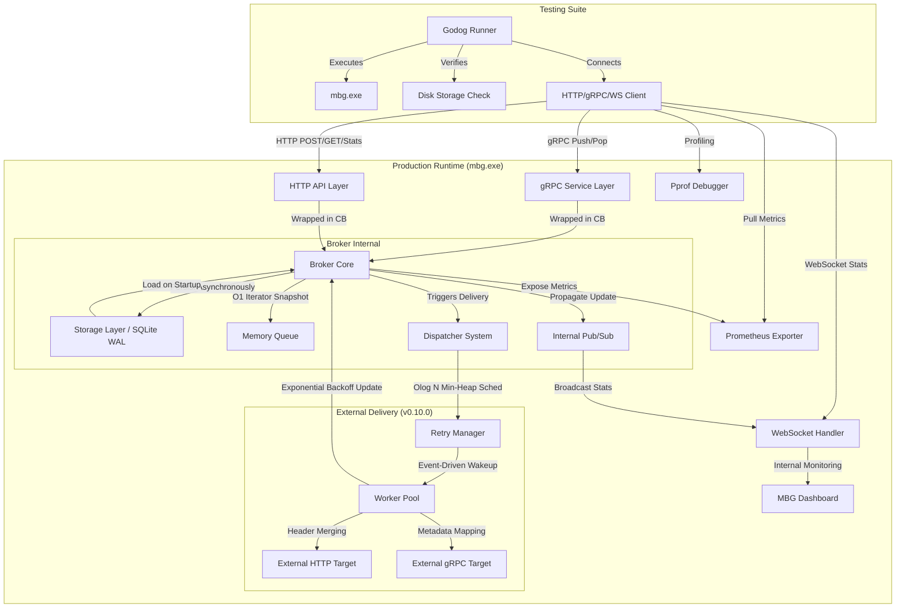
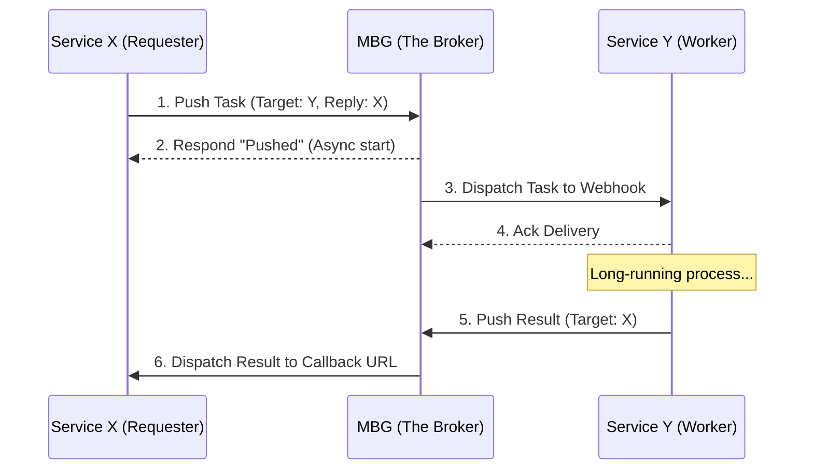

# Arsitektur Sistem Message Broker (MBS) - v0.10.0 Performance

Sistem MBS v0.10.0 kini memiliki kemampuan performa skala industri dan observabilitas mendalam.

## Diagram Arsitektur Komponen dan Pengujian

## Komponen Utama Baru (v0.10.0 Performance)

### 1. Optimasi Performa Skala Industri
Sistem ini telah mencapai tingkat kematangan baru melalui efisiensi sumber daya yang ketat:
- **O(1) Snapshot Iteration**: Menggunakan Go 1.23 Iterators untuk melakukan iterasi pada antrean tanpa melakukan alokasi slice memori baru, mencegah *memory spikes* pada beban kerja tinggi.
- **Event-Driven Dispatcher**: Menghapus mekanisme polling berkala. Dispatcher kini hanya "bangun" saat ada pesan baru (`Push`) atau saat jadwal retry tepat waktu tiba (`Retry Timer`).
- **O(log N) Min-Heap Scheduling**: Mengelola ribuan jadwal retry secara efisien menggunakan struktur data *Priority Queue* (Min-Heap), menjamin pencarian jadwal retry terdekat dalam waktu `O(1)` dan penyisipan dalam `O(log N)`.

### 2. Full Observability (Prometheus & pprof)
MBG v0.10.0 mendukung pemantauan standar industri:
- **Prometheus Metrics**: Tersedia di `/metrics` untuk memantau throughput, latensi, dan ukuran antrean secara *real-time*.
- **Runtime Profiling**: Endpoint `/debug/pprof/` untuk menganalisis CPU, memori, dan goroutine secara mendalam guna mendeteksi *bottleneck*.

### 3. Strategi Pengujian E2E (v0.9.1 Breakthrough)
Stabilitas **100% (20/20 scenarios passed)** tetap dipertahankan melalui:
- **Service Isolation**: Setiap mock server memiliki buffer pesan terisolasi dan dilindungi mutex.
- **Isolasi Skenario**: Siklus hidup binari `mbg.exe` dikelola secara dinamis untuk setiap skenario.

### 4. Automated Dispatch, Exponential Backoff & Header Support
- **Header Propagation**: Mendukung token otorisasi via HTTP Headers dan gRPC Metadata.
- **Payload Refinement**: Memisahkan metadata broker dari data bisnis (hanya mengirim `payload` di body).
- **Header Merging Strategy**: Penggabungan *default headers* target dengan *dynamic headers* pesan.

## Pola Asynchronous Request-Reply (X-Y-X)

MBG secara formal mendukung pola Request-Reply asinkron:

---

## Mekanisme Keamanan & Ketahanan (Hardening)

- **Zero-Block Dispatcher**: Logika pengiriman dipisahkan dari I/O persistensi guna menghilangkan *lag* pengiriman.
- **SQLite WAL (Write-Ahead Logging)**: Menjamin konkurensi throughput pembacaan metrik dan penulisan pesan.
- **Circuit Breaker Integration**: Melindungi sistem dari target yang *unresponsive* melalui mekanisme proteksi asinkron.
