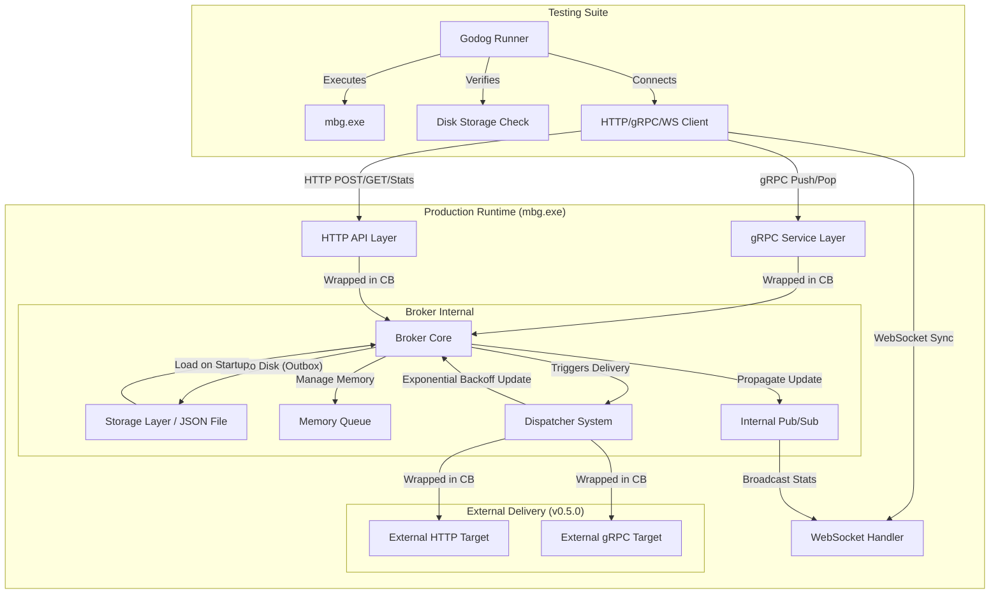

# Arsitektur Sistem Message Broker (MBS) - Lanjutan

Sistem MBS kini memiliki kemampuan observabilitas yang lebih baik dan strategi pengujian yang komprehensif.

## Diagram Arsitektur Komponen dan Pengujian

## Komponen Utama Baru (Lanjutan)

### 1. Strategi Pengujian E2E (End-to-End)
Sistem ini kini diverifikasi menggunakan strategi pengujian terhadap objek binari asli (`mbg.exe`). Ini menjamin bahwa perilaku sistem di lingkungan produksi benar-benar sesuai dengan spesifikasi fungsional:
- **Verifikasi Protokol**: Pengujian secara sinkron terhadap gRPC, HTTP, dan WebSocket.
- **Isolasi Skenario**: Setiap skenario pengujian secara dinamis memulai dan mematikan proses `mbg.exe` untuk menjamin kebersihan state antar pengujian.
- **Validasi Durabilitas**: Pengujian memverifikasi keberadaan file JSON di `../data/messages/` untuk memastikan persistensi benar-benar terjadi sebelum respons dikembalikan ke klien.

### 2. Dukungan JSON Dinamis & Multi-Target Eksternal
Handler gRPC dan HTTP kini dirancang untuk menangani payload JSON yang lebih kompleks. Sistem dapat bertindak sebagai transportasi *Microservice* dengan dukungan *forwarding* ke berbagai rute yang terdefinisi sebelumnya menggunakan format identifikasi seperti `grpc://...`.

### 3. Kemampuan Observabilitas (Observability)
Dasbor waktu nyata bukan hanya sekadar visualisasi, tetapi juga berfungsi sebagai titik verifikasi kesehatan sistem (*health check*) yang memantau metrik antrean secara kontinu melalui WebSockets.

### 4. Automated Dispatch & Exponential Backoff
Sistem pengiriman sekarang secara otomatis memonitor seluruh pesan antrean yang siap untuk diteruskan (*ready to be dispatched*) menggunakan `Dispatcher` yang berjalan secara asynchronous:
- Secara adaptif mengubah jarak waktu pengiriman ulang (*NextRetry*) berdasarkan kelipatan *Exponential Backoff* saat percobaan pertama gagal.
- Integrasi mulus yang melindungi target maupun layanan melalui limitasi yang aman via *Circuit Breaker*.

## Mekanisme Keamanan & Ketahanan (Lanjutan)

- **Manajemen Proses**: Penggunaan utilitas sistem (seperti `taskkill` pada Windows) selama pengujian untuk mengelola siklus hidup aplikasi secara otomatis.
- **Health Check Integration**: Setiap klien (termasuk unit pengujian) kini melakukan pengecekan kesehatan melalui `/api/health` sebelum memulai transaksi, meningkatkan ketersediaan layanan.
